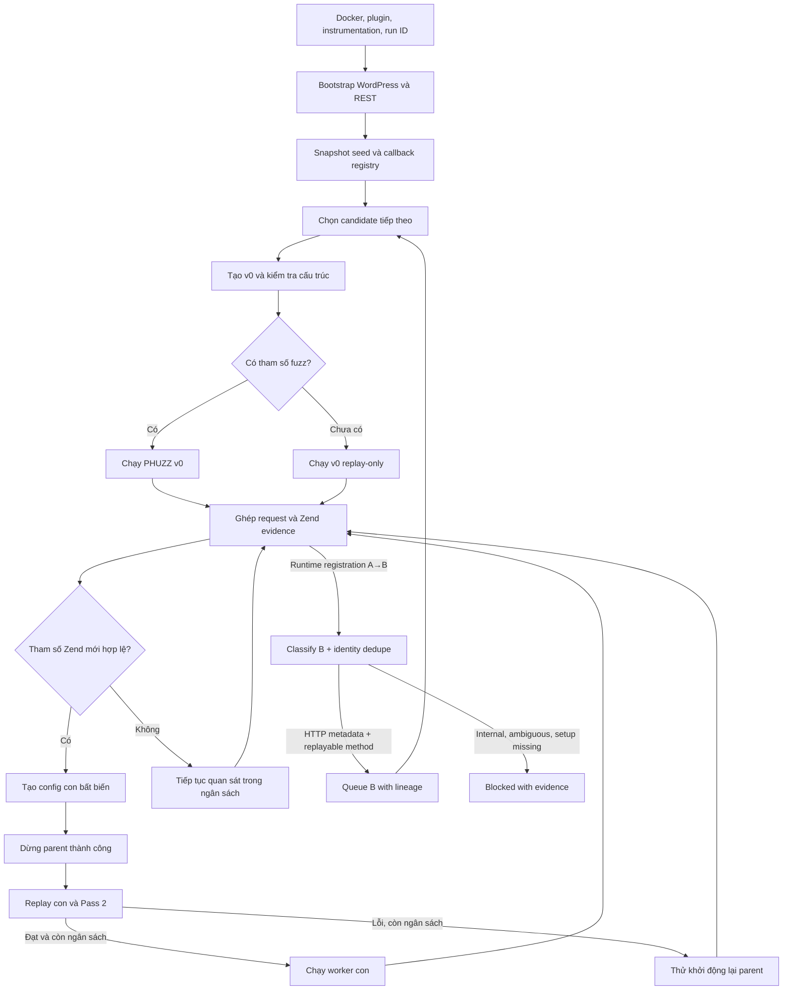

# Luồng online của HookPhuzz

Cập nhật: 2026-09-13. Tài liệu mô tả `-Mode online-linked` theo mã hiện tại, bao gồm batching probe, provenance/evidence, COOKIE runtime opt-in, direct-argument Zend instrumentation, trạng thái lỗi và kiểm tra ngân sách. Đã có fresh fixture/Docker gates cho các thay đổi này; chưa có lần chạy Docker toàn tuyến với real plugin xác minh tất cả 10 bước.

Kế hoạch bổ sung: [Online-linked completion](../../../../../docs/superpowers/plans/2026-09-06-online-linked-completion.md). Những phần ghi “còn thiếu” bên dưới là công việc tương lai, không phải tính năng đã hoạt động.

## 1. Phân biệt các mode

| Mode | Cách chạy hiện tại |
| --- | --- |
| `generated` | Xuất config theo pipeline generated; có thể bật `-UseZendDiscovery`. Không bị thay đổi bởi bản sửa vòng đời online-linked. |
| `online` | Coordinator cũ chọn một target, tạo các phiên bản bất biến; replay gate kiểm tra callback nhưng chưa gọi `verify_pass2_contract()` như online-linked. Không coi hai mode là tương đương. |
| `online-linked` | Đọc snapshot `suggested_seeds.json`, xử lý từng candidate tuần tự; mỗi candidate có `v0` và các worker con được kiểm tra replay/Pass 2. |

Các đường dẫn source bên dưới tính từ `phuzz-main/code`.

## 2. Luồng đang được nối trong code



Sơ đồ biểu diễn đường đi thành công và nhánh phục hồi chính. Hết thời gian, hết số phiên bản, worker lỗi hoặc tìm thấy vulnerability có xử lý kết thúc riêng. Các worker đã chạy không được sửa config tại chỗ.

## 3. Đối chiếu mục tiêu 10 bước

| Bước | Mục tiêu | Hiện trạng code và giới hạn |
| --- | --- | --- |
| 1 | Khởi tạo Docker, plugin, instrumentation và run ID | Có trong wrapper. HTTP 200 và bật biến môi trường chưa chứng minh Zend/UOPZ đã tạo evidence hợp lệ. |
| 2 | Truy cập entrypoint, thu hook/route đăng ký trong runtime | Có bootstrap và hook đăng ký runtime; online-linked đọc registration trong request artifact, xác minh parent/request ID, cập nhật registry và queue HTTP child. Internal/ambiguous registrations vẫn blocked. |
| 3 | Request khởi đầu đúng endpoint, method, auth | Có chuyển seed thành request/config và các gate. Chưa tự chuẩn bị đầy đủ auth, nonce, dữ liệu ứng dụng cho mọi plugin; replay probe không đồng nghĩa đã xác minh method/ngữ cảnh. |
| 4 | Replay tìm tham số đúng callback, nguồn input | Có ghép exact request ID/run ID/plugin và convergence kiểm tra provenance. Raw direct-argument read giữ provenance từ root `FETCH_FUNC_ARG`; chỉ nhận evidence có raw `read` hợp lệ. |
| 5 | Tạo, kiểm chứng config đầu; xử lý chưa có tham số | Có `replay_only` và `fuzzing_ready`; v0 phải qua replay callback/provenance và Pass 2 trước khi fuzz. Seed không có tham số chỉ chạy probe/replay bounded hoặc ghi blocked. |
| 6 | Chạy PHUZZ khi config đủ điều kiện | Có cho candidate đang được xử lý. Worker con phải qua replay/Pass 2 và còn ngân sách. |
| 7 | Thu coverage, lỗi, tham số mới, so sánh khi fuzz | Có trong fuzzer và instrumentation; coordinator đọc cặp request/Zend. |
| 8 | CmpLog mutation đúng tham số rồi gửi lại | Có `_ingest_cmplog_hints()` → `ff_mutate()` → `ff_send_request()` → coverage/lỗi. Có test đơn vị; không mặc định mọi phép so sánh đều được hỗ trợ hoặc mọi nhánh đều tới được. |
| 9 | Tạo config khi nhánh/tham số mới, giữ giá trị mở nhánh | Tạo config theo tham số Zend mới, giữ evidence/value riêng cho từng parameter và map COOKIE vào bucket `cookies`. Không tạo config chỉ vì coverage mới. |
| 10 | Chạy config mới; action mới quay về bước 2, tham số mới về bước 3 | Child parameter config giữ request values rồi replay/Pass 2. Runtime HTTP registration và pending probe được queue với lineage/evidence riêng, dedupe theo context/input, candidate cap và campaign budget; internal/ambiguous child có evidence blocked. |

### Giới hạn giữ giá trị mở nhánh

`advance_online_version()` gọi `materialize_convergence_seeds(..., for_replay=False)`, xuất config rồi sao chép config đó sang replay-only. Materializer thay tham số đã chứng minh bằng `FUZZ`; exporter khởi tạo giá trị fuzz bằng `fuzz`. `_force_replay_only()` chỉ cố định config vừa xuất, không phục hồi giá trị request gốc.

Ví dụ kiểm tra bằng helper hiện tại:

```text
request mở nhánh: mode=deep
Zend quan sát: mode, detail
replay con: mode=fuzz, detail=fuzz
```

Nếu `detail` chỉ được đọc khi `mode == "deep"`, replay có thể mất nhánh. Cần giữ request chứng cứ và chứng minh replay vẫn tới nhánh trước khi khởi động worker con. Không hard-code `deep` hoặc giá trị của plugin vào thuật toán.

### Giới hạn auth và đăng ký hook

Exporter mang theo dữ liệu cookie có trong seed; nó không tự chạy toàn bộ login automation. Môi trường UOPZ có các override liên quan login/capability/nonce, nên callback reachability trong môi trường này không tự chứng minh hành vi auth nguyên bản của plugin.

Một `add_action()` mới có thể chỉ là hook nội bộ, không có URL gọi trực tiếp. Muốn quay về bước 2 phải xác định hook loại nào, parent request nào làm nó xuất hiện và điều kiện để tái lập đăng ký. Không tự suy ra HTTP endpoint từ tên hook bất kỳ.

### Runtime COOKIE opt-in

Online-linked có thể bật khám phá COOKIE bằng `--runtime-cookie-probes`. Mặc định tùy chọn này tắt, nên generated/static discovery và các lệnh online-linked không truyền cờ vẫn giữ policy cũ; `parameter_seeds.py` vẫn block COOKIE tĩnh trên diện rộng.

Khi bật, chỉ COOKIE có raw read được gán đúng callback và request artifact cùng `run_id`/`request_id` mới được nhận. Artifact chỉ lưu danh sách tên cookie, không lưu giá trị. `isset`/`empty` không đủ để admission và sẽ tạo candidate pending để probe; probe dùng marker synthetic, rồi phải vượt lại callback/read/request và Pass 2. COOKIE được giữ ở mapping `COOKIE` → `cookie` → seed/config `cookies`, nên không nhập với POST trùng tên.

Giá trị cookie do setup quản lý, nhất là login cookie, không được lấy từ artifact để fuzz hoặc ghi đè. Exporter/request preparation vẫn gửi cookie qua bucket riêng; verifier kiểm tra membership tên cookie cùng callback, raw read và exact artifact IDs. Wrapper PowerShell chưa đổi; cờ được truyền ở coordinator online-linked.

### Queue probe và provenance của evidence

Khi một probe chưa đủ điều kiện admission nhưng đã có artifact correlate được, coordinator giữ outcome `pending` gồm `candidate`, convergence report và evidence nguồn. Mỗi queue item có bản sao riêng; không dùng report hoặc request/Zend evidence của probe cuối cho các candidate trước đó.

Ví dụ: probe `a` có thể phát hiện candidate `c`; `c` được chạy với merged seed report và evidence của `a`, trong khi candidate `b` đã có trong queue vẫn giữ report/evidence ban đầu. Candidate mới chỉ được giữ pending cho tới khi có correlated raw read đúng callback/request/run và bucket; không tự admit `unexpected_parameters`.

Dedupe dùng parent/callback/context, source/location và toàn bộ input request (`query_params`, `body_params`, `json_params`, `cookies`), bỏ qua request ID và metadata. Vì vậy cùng candidate với input mới có thể retry trong `MAX_PROBE_ATTEMPTS`; cycle hoặc cùng input không lặp vô hạn. Deadline probe là phần ngân sách riêng, phần còn lại dành cho export/replay/handoff child; accepted evidence vẫn được giữ nếu probe sau timeout hoặc thất bại.

### Direct argument và Zend raw-read evidence

Fixture direct-argument dùng lời gọi thật `hookphuzz_runtime_sink($_POST['data'])`, một helper depth riêng, direct/local reads và các control `isset`/`empty`. Với PHP compile thành root `FETCH_FUNC_ARG` rồi `FETCH_DIM_FUNC_ARG`, extension phải giữ provenance từ root fetch tới dimension read; `isset` hoặc `empty` không được đổi thành `read`.

Fresh Docker gate sau rebuild extension ghi đủ `data`, `helper`, `direct`, `nested` và `local` raw `read`, đồng thời giữ `guard` là `isset` và `empty_guard` là `empty`, với `dropped_event_count=0`. Chi tiết version, image/source parity, opcode dump và raw event summary nằm trong [results report](../../../../docs/superpowers/plans/2026-09-13-online-linked-luna-results.md).

## 4. Cách chạy và ngân sách

Từ `phuzz-main/code`, cần có Docker, `wp-cli.phar`, ZIP plugin và bootstrap config tương ứng. Ví dụ cho plugin đã có sẵn cục bộ:

```powershell
rtk proxy powershell -NoProfile -File .\phuzz.ps1 -Mode online-linked -PluginSlug nmedia-user-file-uploader -UseZendDiscovery -OnlineTimeoutSeconds 60 -OnlineMaxVersions 3 -NoFollowLogs
```

Đây là lệnh chạy, không phải tuyên bố plugin đã PASS trên checkout hiện tại. Nếu tên plugin/config khác, thay bằng slug đã kiểm tra trên máy.

- `OnlineTimeoutSeconds`: 1–120 giây, mặc định 60, **cho từng candidate**; không phải timeout toàn batch hay Docker build/bootstrap.
- `OnlineMaxVersions`: 1–20, mặc định 2, tính cả `v0` và phiên bản đã tạo nhưng replay thất bại.
- `OnlineMaxCandidates`: 1–128, mặc định 32, giới hạn candidate cả initial và runtime expansion.
- `OnlineCampaignTimeoutSeconds`: 1–86400, mặc định 600, wall-clock budget toàn batch; khác timeout từng candidate.
- Không bắt đầu xử lý evidence để mở rộng khi deadline đã hết. Sau khi dừng parent, nếu còn dưới 1 giây thì không bắt đầu replay mới.
- Sau replay, hết ngân sách thì không khởi động worker con hoặc khởi động lại parent.
- Các lệnh Docker đang thực thi và cleanup vẫn có timeout riêng; thời gian thực tổng cộng có thể vượt ngân sách fuzz. Không coi `60` là giới hạn wall-clock cứng cho toàn lệnh.
- Coordinator dừng candidate khi nhận exit code `1337 % 256 = 57`. Batch hiện tiếp tục candidate khác; cần kiểm chứng marker vulnerability giữa các candidate trước khi coi từng kết quả là phát hiện độc lập.
- Runtime child cập nhật registry theo batch; wrapper dùng `--sync-registry` để nạp lại file vào web container trước replay candidate kế tiếp. Refresh lỗi chặn child.

## 5. Artifact và cách đọc kết quả

```text
fuzzer/output/online-seed-generation/<run-id>/suggested_seeds.json
fuzzer/output/online-linked/<run-id>/batch-state.json
fuzzer/output/online-linked/<storage-id>/state.json
fuzzer/output/online-linked/<storage-id>/events.jsonl
fuzzer/output/online-linked/<storage-id>/versions/vN/
fuzzer/configs/online-linked/<plugin-slug>/<storage-id>/versions/vN/vN-config.json
fuzzer/configs/online-linked/<plugin-slug>/<storage-id>/versions/vN/replay/vN-replay.json
fuzzer/output/online-linked/<batch-run-id>/callback-registry.json
```

`storage-id` của candidate là 16 ký tự đầu SHA-256 của candidate run ID để giảm độ dài đường dẫn Windows. Run ID đầy đủ vẫn nằm trong state/evidence. Lấy `state_path` từ từng dòng `batch-state.json`, không tự ghép tên thư mục từ plugin/hook. Batch state ghi `max_candidates`, `campaign_seconds`, `campaign_status`, expansion events và lineage của candidate runtime. Wrapper in batch state và `state_path` thực tế.

| Trạng thái/lý do | Cách hiểu |
| --- | --- |
| `complete_with_skips` | Batch đã xử lý hết hàng đợi nhưng có candidate lỗi/chưa xác minh hoặc child bị chặn. CLI trả 0 để wrapper hoàn tất; xem trạng thái và mã lỗi từng candidate, không coi đây là xác minh PASS. |
| `BOUNDED_ONLINE_COMPLETE` / `BUDGET_EXPIRED` | Kết thúc phần chạy có giới hạn; không chứng minh discovery đã đầy đủ hay có vulnerability. |
| `NOT_VERIFIED` / `V0_PREREQUISITE_GATE_FAILED` | Chưa có v0 thỏa điều kiện; cần xem seed, method, callback và config. |
| `NOT_VERIFIED` / `WORKER_STOP_FAILED` | Không xác nhận được worker đã dừng; giữ tên container, chặn handoff, trả mã lỗi. Xem `stop_error`. |
| `NOT_VERIFIED` / `CHILD_REPLAY_FAILED` | Replay/Pass 2 không đạt. Dừng worker hiện tại ngay, giữ `replay_result`, artifact và lý do của child, rồi chuyển candidate kế tiếp mà không đợi hết budget. |
| `NOT_VERIFIED` / `CHILD_WORKER_START_FAILED` hoặc `PARENT_WORKER_RESTART_FAILED` | Lỗi khởi động worker; không được ghi thành hoàn thành bình thường. |
| `not_started_budget_expired` | Config có thể đã được tạo hoặc replay, nhưng worker chưa khởi động vì hết ngân sách. |
| `NO_NEW_ZEND_PARAMETER` | Quan sát đó không bổ sung tham số; không chứng minh không còn nhánh chưa khám phá. |
| `ACTION_EXPANSION_SETUP_REQUIRED` | Registration có thật nhưng thiếu direct-HTTP mapping, method/route evidence hoặc prerequisite replay; không tạo request suy đoán. |
| `CALLBACK_REGISTRY_REFRESH_FAILED` | Registry child không nạp lại được vào web container; child candidate bị chặn. |
| `CANDIDATE_BUDGET_EXPIRED` / `CAMPAIGN_BUDGET_EXPIRED` | Batch dừng mở rộng theo cap candidate hoặc wall-clock campaign; timeout từng candidate vẫn độc lập. |
| `VULN_FOUND` | Worker báo điều kiện dừng vulnerability; đối chiếu run, request và artifact để xác nhận phát hiện tương ứng. |

Lỗi hoặc timeout riêng của candidate được ghi `NOT_VERIFIED` và không hủy hàng đợi còn lại. Giới hạn `OnlineMaxCandidates` và `OnlineCampaignTimeoutSeconds` vẫn áp dụng; lỗi đầu vào chung hoặc không ghi được batch state vẫn làm CLI thất bại.

## 6. Source map và kiểm chứng

| Thành phần | Source |
| --- | --- |
| Chọn mode | [phuzz.ps1](../../phuzz.ps1) |
| Docker, bootstrap, export seed/registry | [run-wordpress-phuzz.ps1](../../scripts/wordpress/run-wordpress-phuzz.ps1) |
| Vòng phiên bản, handoff, deadline, state | [online_linked_coordinator.py](../../fuzzer/hook_energy/seed_generation/online_linked_coordinator.py) |
| Coordinator online cũ, kiểm tra cấu trúc v0 | [online_config_runner.py](../../fuzzer/hook_energy/seed_generation/online_config_runner.py) |
| Convergence và Pass 2 | [bridge_cli.py](../../fuzzer/hook_energy/seed_generation/zend_runtime/bridge_cli.py) |
| Materialization và exporter | [convergence.py](../../fuzzer/seed_generation/convergence/convergence.py), [config_exporter.py](../../fuzzer/seed_generation/config/config_exporter.py) |
| Root fetch provenance và raw events | [hookphuzz_opcode.c](../../fuzzer/zend_discovery/extension/hookphuzz_opcode.c), [direct-argument fixture](../../fuzzer/tests/fixtures/hookphuzz-direct-argument-fixture.php) |
| CmpLog và mutation | [fuzzer.py](../../fuzzer/fuzzer.py), [hints.py](../../fuzzer/fuzz_guidance/cmplog/hints.py) |

Kiểm tra hồi quy coordinator/runner/wrapper từ `phuzz-main/code`, timeout toàn tiến trình test 180 giây:

```powershell
rtk proxy python -c "import subprocess,sys; r=subprocess.run([sys.executable,'-m','unittest','fuzzer.tests.test_online_linked_coordinator','fuzzer.tests.test_online_config_runner','fuzzer.tests.test_phuzz_wrapper_contract','fuzzer.tests.test_generated_config_runner','fuzzer.tests.test_cmplog','fuzzer.tests.test_cmplog_extension'],timeout=180); sys.exit(r.returncode)"
```

Fresh validation ngày 2026-09-13: focused online-linked/Zend/exporter/probe suite đạt `234 tests OK`; full discovery đạt `542 tests`, còn `2 errors` và `1 skipped`. Hai lỗi full-suite được ghi nguyên văn và không được tự phân loại baseline trong [results report](../../../../docs/superpowers/plans/2026-09-13-online-linked-luna-results.md). Đây là unit/contract và fixture gates; chưa thay thế real-plugin end-to-end run có đủ auth/nonce/selector setup.

Khi nghiệm thu phải báo riêng: đăng ký → request đúng ngữ cảnh → callback executed → tham số/provenance → config tạo được → replay/Pass 2 → worker đã chạy → coverage/CmpLog → vulnerability. Không gộp HTTP 200, callback reachability hoặc test mock thành PASS toàn tuyến.
