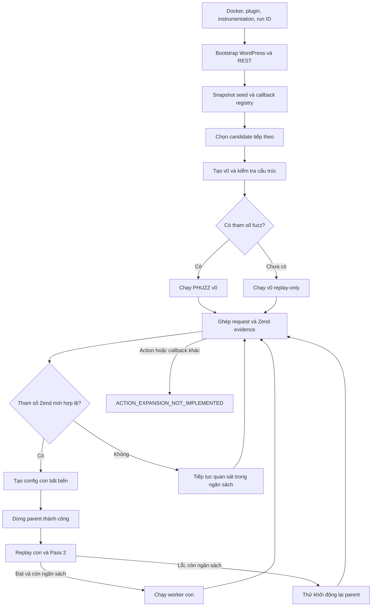

# Luồng online của HookPhuzz

Cập nhật: 2026-09-06. Tài liệu mô tả `-Mode online-linked` theo mã hiện tại, bao gồm bản sửa chuyển worker, trạng thái lỗi và kiểm tra ngân sách. **Chưa có lần chạy Docker toàn tuyến xác minh tất cả 10 bước sau bản sửa.**

Kế hoạch bổ sung: [Online-linked completion](../../../../../docs/superpowers/plans/2026-09-06-online-linked-completion.md). Những phần ghi “còn thiếu” bên dưới là công việc tương lai, không phải tính năng đã hoạt động.

## 1. Phân biệt các mode

| Mode | Cách chạy hiện tại |
| --- | --- |
| `generated` | Xuất config theo pipeline generated; có thể bật `-UseZendDiscovery`. Không bị thay đổi bởi bản sửa vòng đời online-linked. |
| `online` | Coordinator cũ chọn một target, tạo các phiên bản bất biến; replay gate kiểm tra callback nhưng chưa gọi `verify_pass2_contract()` như online-linked. Không coi hai mode là tương đương. |
| `online-linked` | Đọc snapshot `suggested_seeds.json`, xử lý từng candidate tuần tự; mỗi candidate có `v0` và các worker con được kiểm tra replay/Pass 2. |

Các đường dẫn source bên dưới tính từ `phuzz-main/code`.

## 2. Luồng đang được nối trong code



Sơ đồ biểu diễn đường đi thành công và nhánh phục hồi chính. Hết thời gian, hết số phiên bản, worker lỗi hoặc tìm thấy vulnerability có xử lý kết thúc riêng. Các worker đã chạy không được sửa config tại chỗ.

## 3. Đối chiếu mục tiêu 10 bước

| Bước | Mục tiêu | Hiện trạng code và giới hạn |
| --- | --- | --- |
| 1 | Khởi tạo Docker, plugin, instrumentation và run ID | Có trong wrapper. HTTP 200 và bật biến môi trường chưa chứng minh Zend/UOPZ đã tạo evidence hợp lệ. |
| 2 | Truy cập entrypoint, thu hook/route đăng ký trong runtime | Có bootstrap và hook đăng ký runtime; chưa có vòng cập nhật seed/registry và mở rộng khám phá liên tục từ action mới. |
| 3 | Request khởi đầu đúng endpoint, method, auth | Có chuyển seed thành request/config và các gate. Chưa tự chuẩn bị đầy đủ auth, nonce, dữ liệu ứng dụng cho mọi plugin; replay probe không đồng nghĩa đã xác minh method/ngữ cảnh. |
| 4 | Replay tìm tham số đúng callback, nguồn input | Có ghép exact request ID/run ID/plugin và convergence kiểm tra provenance. Chỉ nhận evidence hợp lệ. |
| 5 | Tạo, kiểm chứng config đầu; xử lý chưa có tham số | Có `replay_only` và `fuzzing_ready`. `validate_v0_config()` kiểm tra cấu trúc; chưa bắt buộc một replay/Pass 2 riêng trước mọi v0 fuzzing. |
| 6 | Chạy PHUZZ khi config đủ điều kiện | Có cho candidate đang được xử lý. Worker con phải qua replay/Pass 2 và còn ngân sách. |
| 7 | Thu coverage, lỗi, tham số mới, so sánh khi fuzz | Có trong fuzzer và instrumentation; coordinator đọc cặp request/Zend. |
| 8 | CmpLog mutation đúng tham số rồi gửi lại | Có `_ingest_cmplog_hints()` → `ff_mutate()` → `ff_send_request()` → coverage/lỗi. Có test đơn vị; không mặc định mọi phép so sánh đều được hỗ trợ hoặc mọi nhánh đều tới được. |
| 9 | Tạo config khi nhánh/tham số mới, giữ giá trị mở nhánh | Mới tạo config theo tham số Zend mới. Chưa tạo config chỉ vì coverage mới, chưa giữ đầy đủ giá trị request mở nhánh trong replay con. |
| 10 | Chạy config mới; action mới quay về bước 2, tham số mới về bước 3 | Có chuỗi phiên bản theo tham số trong giới hạn thời gian/số phiên bản. Action/callback mới chưa được đưa lại vào discovery queue. |

### Giới hạn giữ giá trị mở nhánh

`advance_online_version()` gọi `materialize_convergence_seeds(..., for_replay=False)`, xuất config rồi sao chép config đó sang replay-only. Materializer thay tham số đã chứng minh bằng `FUZZ`; exporter khởi tạo giá trị fuzz bằng `fuzz`. `_force_replay_only()` chỉ cố định config vừa xuất, không phục hồi giá trị request gốc.

Ví dụ kiểm tra bằng helper hiện tại:

```text
request mở nhánh: mode=deep
Zend quan sát: mode, detail
replay con: mode=fuzz, detail=fuzz
```

Nếu `detail` chỉ được đọc khi `mode == "deep"`, replay có thể mất nhánh. Cần giữ request chứng cứ và chứng minh replay vẫn tới nhánh trước khi khởi động worker con. Không hard-code `deep` hoặc giá trị của plugin vào thuật toán.

### Giới hạn auth và đăng ký hook

Exporter mang theo dữ liệu cookie có trong seed; nó không tự chạy toàn bộ login automation. Môi trường UOPZ có các override liên quan login/capability/nonce, nên callback reachability trong môi trường này không tự chứng minh hành vi auth nguyên bản của plugin.

Một `add_action()` mới có thể chỉ là hook nội bộ, không có URL gọi trực tiếp. Muốn quay về bước 2 phải xác định hook loại nào, parent request nào làm nó xuất hiện và điều kiện để tái lập đăng ký. Không tự suy ra HTTP endpoint từ tên hook bất kỳ.

## 4. Cách chạy và ngân sách

Từ `phuzz-main/code`, cần có Docker, `wp-cli.phar`, ZIP plugin và bootstrap config tương ứng. Ví dụ cho plugin đã có sẵn cục bộ:

```powershell
rtk proxy powershell -NoProfile -File .\phuzz.ps1 -Mode online-linked -PluginSlug nmedia-user-file-uploader -UseZendDiscovery -OnlineTimeoutSeconds 60 -OnlineMaxVersions 3 -NoFollowLogs
```

Đây là lệnh chạy, không phải tuyên bố plugin đã PASS trên checkout hiện tại. Nếu tên plugin/config khác, thay bằng slug đã kiểm tra trên máy.

- `OnlineTimeoutSeconds`: 1–60 giây, mặc định 60, **cho từng candidate** sau khi worker v0 khởi động; không phải timeout toàn batch hay Docker build/bootstrap.
- `OnlineMaxVersions`: 1–20, mặc định 2, tính cả `v0` và phiên bản đã tạo nhưng replay thất bại.
- Không bắt đầu xử lý evidence để mở rộng khi deadline đã hết. Sau khi dừng parent, nếu còn dưới 1 giây thì không bắt đầu replay mới.
- Sau replay, hết ngân sách thì không khởi động worker con hoặc khởi động lại parent.
- Các lệnh Docker đang thực thi và cleanup vẫn có timeout riêng; thời gian thực tổng cộng có thể vượt ngân sách fuzz. Không coi `60` là giới hạn wall-clock cứng cho toàn lệnh.
- Coordinator dừng candidate khi nhận exit code `1337 % 256 = 57`. Batch hiện tiếp tục candidate khác; cần kiểm chứng marker vulnerability giữa các candidate trước khi coi từng kết quả là phát hiện độc lập.

## 5. Artifact và cách đọc kết quả

```text
fuzzer/output/online-seed-generation/<run-id>/suggested_seeds.json
fuzzer/output/online-linked/<run-id>/batch-state.json
fuzzer/output/online-linked/<storage-id>/state.json
fuzzer/output/online-linked/<storage-id>/events.jsonl
fuzzer/output/online-linked/<storage-id>/versions/vN/
fuzzer/configs/online-linked/<storage-id>/versions/vN/config.json
```

`storage-id` của candidate là 16 ký tự đầu SHA-256 của candidate run ID để giảm độ dài đường dẫn Windows. Run ID đầy đủ vẫn nằm trong state/evidence. Lấy `state_path` từ từng dòng `batch-state.json`, không tự ghép tên thư mục từ plugin/hook. Thông báo cuối của PowerShell wrapper hiện vẫn ghép đường dẫn `<run-id>/state.json`; ưu tiên đường dẫn batch do Python in ra và `state_path` thực tế.

| Trạng thái/lý do | Cách hiểu |
| --- | --- |
| `BOUNDED_ONLINE_COMPLETE` / `BUDGET_EXPIRED` | Kết thúc phần chạy có giới hạn; không chứng minh discovery đã đầy đủ hay có vulnerability. |
| `NOT_VERIFIED` / `V0_PREREQUISITE_GATE_FAILED` | Chưa có v0 thỏa điều kiện; cần xem seed, method, callback và config. |
| `NOT_VERIFIED` / `WORKER_STOP_FAILED` | Không xác nhận được worker đã dừng; giữ tên container, chặn handoff, trả mã lỗi. Xem `stop_error`. |
| `NOT_VERIFIED` / `CHILD_REPLAY_FAILED` | Replay/Pass 2 không đạt. Xem `replay_result`, artifact và lý do của child; parent chỉ được khởi động lại khi còn ngân sách. |
| `NOT_VERIFIED` / `CHILD_WORKER_START_FAILED` hoặc `PARENT_WORKER_RESTART_FAILED` | Lỗi khởi động worker; không được ghi thành hoàn thành bình thường. |
| `not_started_budget_expired` | Config có thể đã được tạo hoặc replay, nhưng worker chưa khởi động vì hết ngân sách. |
| `NO_NEW_ZEND_PARAMETER` | Quan sát đó không bổ sung tham số; không chứng minh không còn nhánh chưa khám phá. |
| `ACTION_EXPANSION_NOT_IMPLEMENTED` | Chưa hỗ trợ đưa action/callback mới vào vòng khám phá. |
| `VULN_FOUND` | Worker báo điều kiện dừng vulnerability; đối chiếu run, request và artifact để xác nhận phát hiện tương ứng. |

## 6. Source map và kiểm chứng

| Thành phần | Source |
| --- | --- |
| Chọn mode | [phuzz.ps1](../../phuzz.ps1) |
| Docker, bootstrap, export seed/registry | [run-wordpress-phuzz.ps1](../../scripts/wordpress/run-wordpress-phuzz.ps1) |
| Vòng phiên bản, handoff, deadline, state | [online_linked_coordinator.py](../../fuzzer/hook_energy/seed_generation/online_linked_coordinator.py) |
| Coordinator online cũ, kiểm tra cấu trúc v0 | [online_config_runner.py](../../fuzzer/hook_energy/seed_generation/online_config_runner.py) |
| Convergence và Pass 2 | [bridge_cli.py](../../fuzzer/hook_energy/seed_generation/zend_runtime/bridge_cli.py) |
| Materialization và exporter | [convergence.py](../../fuzzer/seed_generation/convergence/convergence.py), [config_exporter.py](../../fuzzer/seed_generation/config/config_exporter.py) |
| CmpLog và mutation | [fuzzer.py](../../fuzzer/fuzzer.py), [hints.py](../../fuzzer/fuzz_guidance/cmplog/hints.py) |

Kiểm tra hồi quy coordinator/runner/wrapper từ `phuzz-main/code`, timeout toàn tiến trình test 180 giây:

```powershell
rtk proxy python -c "import subprocess,sys; r=subprocess.run([sys.executable,'-m','unittest','fuzzer.tests.test_online_linked_coordinator','fuzzer.tests.test_online_config_runner','fuzzer.tests.test_phuzz_wrapper_contract','fuzzer.tests.test_generated_config_runner','fuzzer.tests.test_cmplog','fuzzer.tests.test_cmplog_extension'],timeout=180); sys.exit(r.returncode)"
```

Tại thời điểm soạn: nhóm coordinator/runner/wrapper đã đạt 108 test; nhóm CmpLog đạt 9 test. Đây là unit/contract checks. Artifact N-Media chạy từng bước trước đó có Pass 2 `1/1` và summary `PathTraversal`, nhưng không thay thế fresh automated end-to-end run sau bản sửa.

Khi nghiệm thu phải báo riêng: đăng ký → request đúng ngữ cảnh → callback executed → tham số/provenance → config tạo được → replay/Pass 2 → worker đã chạy → coverage/CmpLog → vulnerability. Không gộp HTTP 200, callback reachability hoặc test mock thành PASS toàn tuyến.
