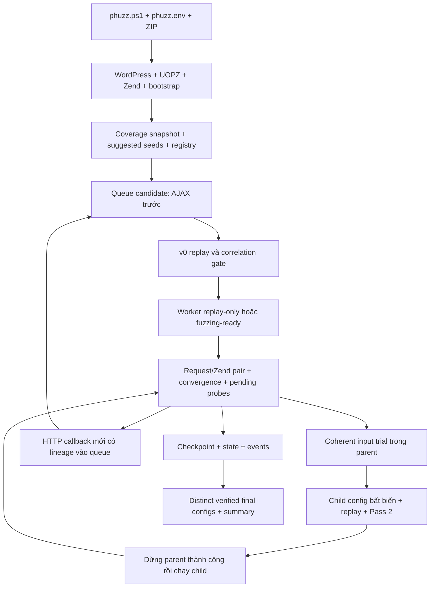

# Kiến trúc và chức năng HookPhuzz

Đối chiếu working tree ngày **2026-10-09**. Đường dẫn source trong bảng là link từ tài liệu này. Mô hình sử dụng: một người vận hành Docker cục bộ; plugin và candidate online-linked chạy tuần tự. Khả năng đồng bộ nhiều fuzzer của PHUZZ/Composegen là chức năng riêng.

## Luồng chính

Gate thất bại chặn bước tiếp theo. Config `replay_only` phục vụ discovery; chỉ config `fuzzing_ready` đủ replay/Pass 2 mới được xuất. Budget bao gồm replay/probe/verification/fuzz, không bảo đảm worker đã dành toàn bộ thời gian cho fuzz.

## Chức năng và nơi sở hữu

| Chức năng | Source chính | Input → output / giới hạn |
| --- | --- | --- |
| CLI, chọn plugin, batch ZIP | [phuzz.ps1](../../phuzz.ps1) | Một slug hoặc `-AllPlugins`; batch sắp ZIP theo tên, chạy tuần tự, tiếp tục sau lỗi, trả 1 nếu có runner lỗi. Không quét ZIP đệ quy. |
| Load env và chọn archive | [read-phuzz-env.ps1](../../scripts/wordpress/read-phuzz-env.ps1) | CLI > `phuzz.env` > loader defaults. ZIP ưu tiên `PLUGIN_ZIP_DIR/<slug>.zip`, thiếu thì fallback `_plugins/<slug>.zip`. |
| Bootstrap Docker/WordPress | [runner](../../scripts/wordpress/run-wordpress-phuzz.ps1), [init.sh](../../web/applications/wordpress/init.sh) | Compose override bật Zend và CMPLOG; mount ZIP tùy chọn read-only tại `/plugin-zips`. Cài plugin/dependency; có setup riêng cho `hp-ap`, LearnPress và CMB2. Không tự chuẩn bị mọi prerequisite của mọi plugin. |
| Khởi chạy coordinator | [invoke-online-linked.ps1](../../scripts/wordpress/invoke-online-linked.ps1) | Dừng bootstrap worker, truyền seed/registry/budget qua `python -m online_linked`; prompt comparison riêng sau run. Override tạm bị xóa khi runner kết thúc. |
| Hook registration/execution | [uopz_hook_wp.php](../../web/instrumentation/hook_coverage/uopz_hook_wp.php), [uopz_hook_runtime.php](../../web/instrumentation/hook_coverage/instrumentation/uopz_hook_runtime.php) | Registry và per-request evidence; metadata parent/child, callback, request, method và auth. [Metadata reference](../guides/multistage-hook-discovery-metadata.md). |
| Zend opcode và REST provenance | [extension](../../fuzzer/zend_discovery/extension/hookphuzz_opcode.c), [REST runtime](../../fuzzer/instrumentation/zend/rest/runtime.py) | Request-local reads/guards/comparisons; attribution callback/helper, source/path và transport. Unsupported provenance không tự thành fuzz field. |
| Runtime-only seed bootstrap | [export_zend_seeds.py](../../fuzzer/cli/export_zend_seeds.py), [candidate_generator.py](../../fuzzer/seed_generation/skeleton/candidate_generator.py) | UOPZ coverage → `hook_gap_report.json`, `suggested_seeds.json`/`.md`; không scan source plugin để suy ra tham số runtime. |
| Phân loại endpoint và method | [entrypoints](../../fuzzer/discovery/entrypoints/entrypoints.py), [classifier](../../fuzzer/discovery/entrypoints/classifier.py), [method resolution](../../fuzzer/discovery/entrypoints/method_resolution.py), [REST routes](../../fuzzer/discovery/wordpress/rest_routes.py) | AJAX, admin-post, REST hoặc internal/setup-required. GET bootstrap chưa có bằng chứng khác; POST probe cần xác minh lại đúng method. |
| Identity, normalize và admission | [engine.py](../../fuzzer/zend_discovery/engine.py) | Ghép run/request/plugin/callback/method/auth; `REQUEST` phải có transport duy nhất. Helper/guard cần evidence hiện tại; COOKIE chỉ khi opt-in. |
| Convergence và Pass 2 | [bridge_cli.py](../../fuzzer/hook_energy/seed_generation/zend_runtime/bridge_cli.py), [convergence.py](../../fuzzer/seed_generation/convergence/convergence.py) | Reads/pending observations → seed proposal; replay xác minh lại expected set. Không union tùy ý tham số từ request khác nhau. |
| Sinh config | [config_exporter.py](../../fuzzer/seed_generation/config/config_exporter.py) | Seed → `replay_only`/`fuzzing_ready`; selector theo regex, fixed thắng fuzz, nonce giữ fixed. JSON request dùng `body_params` và Content-Type; `json_params` trong evidence không tự là bucket loader. |
| Worker lifecycle, budget, resume | [coordinator.py](../../fuzzer/online_linked/coordinator.py) | Immutable `vN`, một worker hoạt động mỗi candidate, AJAX trước; initial/hard budget riêng, progress dedupe, pending/checkpoint và revalidation khi resume. |
| Batch evidence reader | [evidence.py](../../fuzzer/online_linked/evidence.py) | Một Docker/PHP scan → exact request/Zend pairs + stats; bỏ file tạm, thiếu/sai correlation, output muộn hoặc payload lỗi. |
| Probe nhẹ trong parent | [probe_sender.py](../../fuzzer/online_linked/probe_sender.py) | Dùng chung request preparation; gửi one-shot bằng `docker exec` trong worker hiện tại, không tạo worker riêng. Error response tương quan có thể giúp discovery; không nới final replay gate. |
| Coherent replay và CMPLOG proposal | [replay_inputs.py](../../fuzzer/online_linked/replay_inputs.py), [coordinator](../../fuzzer/online_linked/coordinator.py) | Tối đa 4 trial/attempt cùng deadline; điều chỉnh field từ evidence, giữ action/auth/nonce/fixed. Trial không tiêu version và chưa thay final gate. |
| Export config cuối | [export.py](../../fuzzer/online_linked/export.py) | Giữ context khác nhau; dedupe equivalent, collapse cumulative compatible growth, copy nguyên byte, summary và archive `superseded/` khi export lại. [Contract](../../fuzzer/online_linked/README.md). |
| Fuzzer core | [fuzzer.py](../../fuzzer/fuzzer.py), [core](../../fuzzer/core/candidate.py) | Load request, seed, choose/mutate/send/score, coverage, sync và checks. Request preparation phục vụ cả worker và probe. |
| Hook-aware scoring | [scoring.py](../../fuzzer/core/scoring.py), [integration](../../fuzzer/hook_guidance/integration/integration.py), [energy](../../fuzzer/hook_guidance/energy/calculator.py) | Mode 1 PHUZZ / mode 2 PHUZZ+hook; priority additive, energy weighted blend với scale lớn nhất đã thấy trong tracker. |
| CMPLOG mutations | [hints.py](../../fuzzer/fuzz_guidance/cmplog/hints.py), [mutator.py](../../fuzzer/core/mutator.py) | Normalize comparison event rồi mutate đúng parameter; không thêm global dictionary hay coi hint là observed value. |
| Findings, exceptions và errors | [vulncheck.py](../../fuzzer/core/vulncheck.py), [finding_artifact.py](../../fuzzer/core/finding_artifact.py), [instrumentation overrides](../../web/instrumentation/overrides.d/01_exceptions.php) | Report có run/request/mutation/payload; finding signal cần đối chiếu artifact và tái hiện. `HOOKPHUZZ_STOP_ON_VULN=0` tắt dừng theo số finding, không tắt budget. |
| So sánh config offline | [config_comparison](../../fuzzer/config_comparison/README.md), [compare-configs.ps1](../../compare-configs.ps1) | Raw config/reference → MATCH/MISMATCH/INVALID/NO_REFERENCE/AMBIGUOUS. Không chạy HTTP, Docker hay chứng minh runtime parity. |

## Công cụ riêng và phần lịch sử

| Thành phần | Vai trò hiện tại |
| --- | --- |
| [Source-assisted seed generation](../../fuzzer/seed_generation/source_assisted/static_generator.py), [export_seeds](../../fuzzer/cli/export_seeds.py) | Export từ snapshot/source khi gọi riêng. Không trộn provenance source vào runtime-only admission. |
| [Entrypoint pipeline](../../fuzzer/cli/entrypoint_pipeline.py), [seed_to_config](../../fuzzer/cli/seed_to_config.py) | CLI thư viện vẫn có; không khôi phục các mode `generated`, `zend`, `online`, `default`, `seed-config` đã bỏ khỏi wrapper. |
| [Generated replay runner](../../fuzzer/hook_energy/seed_generation/generated_config_runner.py), [online_common](../../fuzzer/hook_energy/seed_generation/online_common.py) | Shared replay, hash, artifact helpers và v0 selection còn được coordinator dùng. |
| [Recursive child seeds](../../fuzzer/hook_energy/recursive_child_hook_seeds.py), [evaluation report](../../fuzzer/hook_energy/evaluation_report.py) | Công cụ artifact/offline; online-linked có queue expansion riêng, không dùng report offline làm PASS. |
| [Retention](../../fuzzer/artifacts/retention/generated_runs.py) | API cho generated runs; bảo toàn lỗi, prune success theo contract. Wrapper online-linked không có `-KeepDebugArtifacts` và không tự gọi API này để prune campaign. |
| [HARgen](../../hargen/README.md), [crawler](../../crawler/README.md), [Composegen](../../composegen/README.md) | HAR → config, browser → HAR, config → Compose. Chạy riêng; generated Compose không tự cài replay/admission gate của coordinator. |
| [Matrix](../../scripts/wordpress/run-wordpress-plugin-matrix.ps1), [benchmark](../../scripts/benchmarks/benchmark-wordpress-phuzz.ps1), [summary](../../fuzzer/benchmarking/summary.py) | Tooling riêng cho validation/config/scoring. Matrix resume khác checkpoint resume online-linked. |
| [Filesystem helpers](../../fuzzer/filesystem_paths.py) | Windows extended-length path dùng cho IO, giữ persisted paths/Docker slugs riêng. Preflight write/replace/read/unlink trước worker; không bảo đảm mọi thư viện ngoài đều hỗ trợ long path. |

## Cấu hình, dữ liệu và kiểm chứng

`phuzz.env` cấu hình wrapper/discovery/comparison; `fuzzer/scoring.env` cấu hình fuzzer/scoring/trace. Compose mặc định chưa bật Zend: runner tạo override để build `web/Dockerfile.zend` với PHP 8.2.10 và extension. Plugin ZIP, image, WordPress data và override là một phần context tái hiện; Git commit riêng không xác định đủ runtime.

Run ID chứa slug và timestamp có hậu tố `Z`; wrapper hiện dùng `Get-Date` theo timezone host, không chuyển UTC trước khi đặt tên. Đừng dùng hậu tố này làm bằng chứng thời gian UTC. Candidate storage ID là 16 ký tự đầu SHA-256 của full candidate run ID; đọc `state_path`, không đoán thư mục.

Các test liên quan nằm trong [tests](../../fuzzer/tests): wrapper/batch/ZIP, entrypoint/method/REST, Zend/Pass 2, convergence/exporter, coordinator/probe/evidence/replay/export, comparison, scoring/CMPLOG, findings và retention. Test unit/contract không thay fresh campaign. Báo riêng config generation → runtime reads → coherent replay/Pass 2 → worker → coverage/CMPLOG → finding/reproduction.

Phạm vi rà lần này: source do dự án quản lý và các luồng chính/callers/tests phục vụ doc. Không audit từng dòng WordPress/plugin bên thứ ba, không chạy lại toàn bộ experiment, build image hoặc fuzzing. Xem [review record](../reports/2026-10-09-documentation-review.md).
